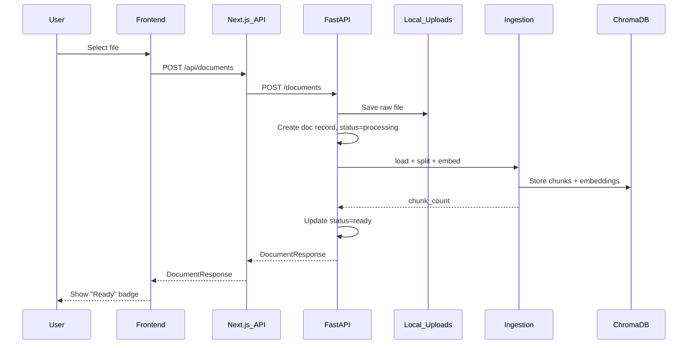
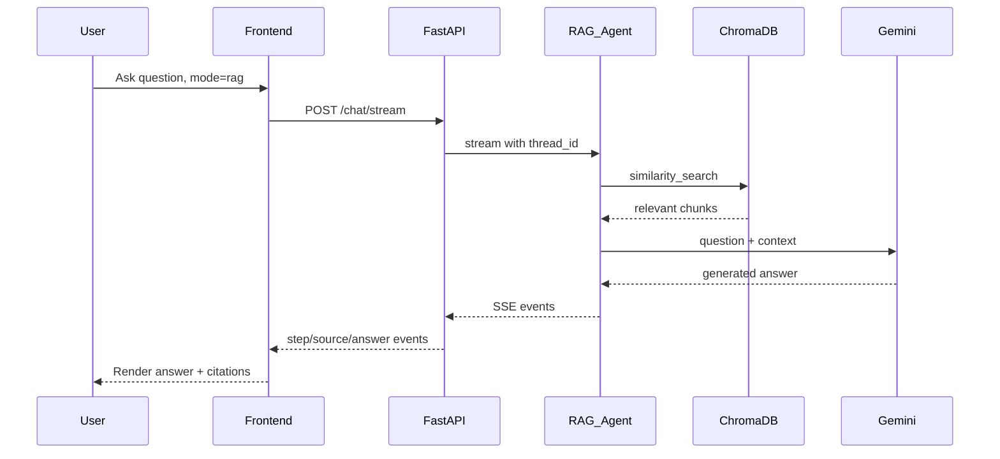

# Phase 2: RAG Implementation Plan

## ChromaDB Setup (Docker)

Run ChromaDB as a Docker container. Since you already have Docker installed:

```bash
docker pull chromadb/chroma
docker run -d --name chromadb -p 8100:8000 -v chroma-data:/chroma/chroma chromadb/chroma
```

This starts ChromaDB on **port 8100** (to avoid conflict with your FastAPI on 8000). The `-v chroma-data` volume persists data across restarts. Verify it works:

```bash
curl http://localhost:8100/api/v1/heartbeat
```

Add to [backend/.env](backend/.env):

```
CHROMA_HOST=localhost
CHROMA_PORT=8100
```

---

## Backend Changes

### 1. New settings in [backend/core/settings.py](backend/core/settings.py)

Add ChromaDB, upload, and embedding config fields:

```python
chroma_host: str = "localhost"
chroma_port: int = 8100
upload_dir: str = "./uploads"
embedding_model: str = "models/gemini-embedding-001"
max_file_size_mb: int = 50
allowed_file_types: tuple[str, ...] = ("pdf", "csv", "txt", "docx")
```

### 2. New service: [backend/services/vectorstore.py](backend/services/vectorstore.py)

Connects to the Docker ChromaDB instance using `chromadb.HttpClient`. Provides:

- `get_or_create_collection()` -- returns a LangChain-compatible ChromaDB collection
- `delete_document_chunks(document_id)` -- removes all chunks for a deleted document

Uses `langchain_chroma.Chroma` wrapper with `GoogleGenerativeAIEmbeddings(model="models/gemini-embedding-001")` (same embedding model from your existing `ragagent.py`).

### 3. New service: [backend/services/ingestion.py](backend/services/ingestion.py)

Document ingestion pipeline (following ARCHITECTURE.md Section 10):

- Accept a saved file path and document metadata
- Load with LangChain loaders: `PyPDFLoader`, `CSVLoader`, `TextLoader`, `Docx2txtLoader`
- Split with `RecursiveCharacterTextSplitter(chunk_size=1000, chunk_overlap=200)`
- Embed and store chunks in ChromaDB with metadata: `document_id`, `filename`, `page`, `chunk_index`
- Return `chunk_count`

### 4. New service: [backend/services/document_store.py](backend/services/document_store.py)

JSON-file-backed store (same pattern as `thread_store.py`) for document metadata:

- `create()` / `list_all()` / `get()` / `update()` / `delete()`
- Tracks: id, filename, file_type, file_size, file_path, status, chunk_count, error_message, created_at

### 5. New route: [backend/api/routes/documents.py](backend/api/routes/documents.py)

API endpoints per ARCHITECTURE.md Section 9.3:


| Method | Endpoint          | Description                                   |
| ------ | ----------------- | --------------------------------------------- |
| GET    | `/documents`      | List all documents                            |
| POST   | `/documents`      | Upload file(s) via multipart/form-data        |
| GET    | `/documents/{id}` | Get document metadata                         |
| DELETE | `/documents/{id}` | Delete document + vector chunks from ChromaDB |


Upload flow:

1. Save file to `backend/uploads/`
2. Create document record with status `"processing"`
3. Run ingestion pipeline
4. Update status to `"ready"` with chunk_count (or `"error"`)

### 6. New agent: RAG agent in [backend/core/agent.py](backend/core/agent.py)

Add `create_rag_agent()` alongside existing `create_sql_agent()`:

- Takes a `retrieve_context` tool that searches ChromaDB
- System prompt instructs agent to use retrieved context to answer questions
- Shares the same checkpointer for thread memory

Add `create_hybrid_agent()`:

- Gets both SQL toolkit tools AND the `retrieve_context` tool
- Prompt instructs it to decide between SQL and document sources

### 7. Agent router in [backend/core/agent.py](backend/core/agent.py) or new [backend/core/agent_router.py](backend/core/agent_router.py)

Based on the `mode` field from `ChatRequest`:

- `"sql"` -- use existing SQL agent
- `"rag"` -- use RAG agent
- `"hybrid"` -- use Hybrid agent (both SQL tools + retriever)

### 8. Update [backend/api/routes/chat.py](backend/api/routes/chat.py)

`stream_agent_events()` needs to accept the `mode` parameter and route to the correct agent. The SSE event types stay the same, with a new `"source"` event type for RAG citations.

### 9. Update [backend/core/app.py](backend/core/app.py) and [backend/main.py](backend/main.py)

`build_app()` now returns additional components: `vectorstore`, `embeddings`. The lifespan initializes ChromaDB connection, embeddings, and creates all three agents (sql, rag, hybrid), storing them on `app.state`.

### 10. Update Pydantic schemas in [backend/models/schemas.py](backend/models/schemas.py)

Add:

- `DocumentResponse` -- id, filename, file_type, file_size, status, chunk_count, created_at
- `DocumentListResponse`
- Update `ChatRequest.mode` to accept `"sql" | "rag" | "hybrid"`

### 11. Update [backend/requirements.txt](backend/requirements.txt)

Add: `chromadb`, `langchain-chroma`, `pypdf`, `python-docx`, `python-multipart`

---

## Frontend Changes

### 12. New types in [frontend/lib/types.ts](frontend/lib/types.ts)

Add `Document` and `Source` interfaces (from ARCHITECTURE.md Section 8.5). Add `sources` field to `Message`.

### 13. New store: [frontend/lib/stores/document-store.ts](frontend/lib/stores/document-store.ts)

Zustand store for document state: `documents[]`, `fetchDocuments()`, `uploadDocument()`, `deleteDocument()`.

### 14. New components for document management

- `components/documents/DocumentSection.tsx` -- sidebar section showing uploaded docs
- `components/documents/DocumentItem.tsx` -- single document row with status badge and delete button
- `components/documents/DocumentUploadButton.tsx` -- triggers file upload dialog

### 15. New API route handlers

- `frontend/app/api/documents/route.ts` -- GET (list), POST (upload) proxy
- `frontend/app/api/documents/[id]/route.ts` -- GET, DELETE proxy

### 16. Update [frontend/components/layout/Sidebar.tsx](frontend/components/layout/Sidebar.tsx)

Add a "Documents" section below "Chats" with the document list and upload button.

### 17. Update [frontend/components/chat/ChatInput.tsx](frontend/components/chat/ChatInput.tsx)

Add a mode selector dropdown (SQL / RAG / Hybrid) next to the send button. Pass the selected mode when sending messages.

### 18. Update [frontend/components/chat/AgentMessage.tsx](frontend/components/chat/AgentMessage.tsx)

Add source citation cards when RAG sources are present in the message.

### 19. Update [frontend/hooks/use-chat-stream.ts](frontend/hooks/use-chat-stream.ts)

Handle new SSE event type `"source"` and pass `mode` in the chat request body.

---

## Data Flow: Document Upload




## Data Flow: RAG Question




---

## Summary of new pip packages

`chromadb`, `langchain-chroma`, `pypdf`, `python-docx`, `python-multipart`

## Summary of new npm packages

`react-dropzone` (drag-and-drop file upload)